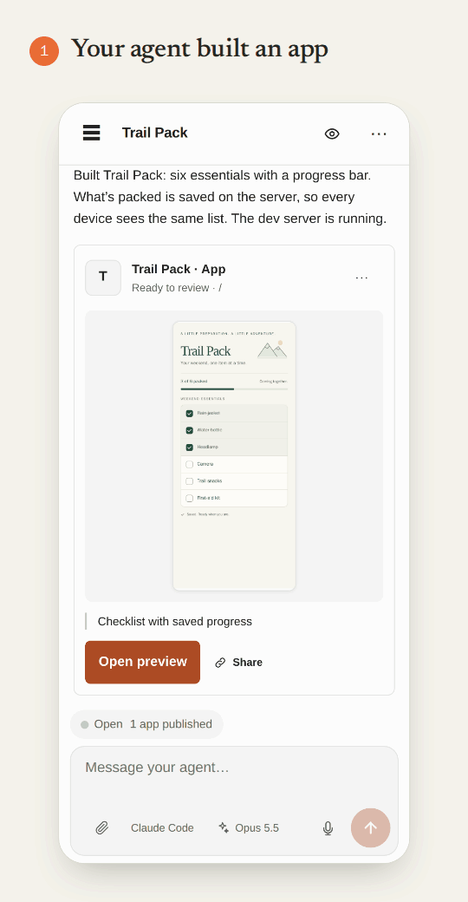

# Bivy

[](https://www.npmjs.com/package/@bivy/bivy)
[](LICENSE)
[](https://nodejs.org)

**Local coding agents that show their work. Anywhere.**

Bivy is the open-source workspace for coding agents. It runs Claude Code, Codex,
Pi, OpenCode and other agents on your own machine. Reach them from a browser or
your phone, with the live session, its terminal, its approvals, and the app
they're building right in the chat. Try it, mark what's wrong, and send it back.

<p align="center">
  
</p>

Bivy is not another coding agent and not a cloud development machine. The agent
stays local and does the coding with your model provider. Your repos, tools,
databases, and services stay where they are. Bivy gives you remote access to all
of it, plus live previews, automations, and review.

- **Live previews.** The running app beside the chat. Mark it, send it back,
  share it with someone who has no Bivy account.
- **Automations.** GitHub issues, failed CI, Linear, Slack, schedules, and
  webhooks start the work. It comes back as a preview link or a pull request.
- **Any agent.** Hit a usage limit? Fork the session to another agent, or let
  Bivy retry when the limit resets.
- **Your machine, anywhere.** Start at your desk, pick the session up on your
  phone. The machine dials out, so there are no ports to open, and session
  traffic is end-to-end encrypted.

**[Start free on Bivy Cloud](https://app.bivy.sh)** ·
**[Quickstart](docs/quickstart.md)** ·
**[Documentation](docs/README.md)** ·
**[Self-host](docs/deploy-images.md)** ·
**[Website](https://bivy.sh)**

**Recommended:** sign in at [app.bivy.sh](https://app.bivy.sh), then copy your
personalized **Connect a Machine** command into a terminal on your Mac or Linux
computer. It installs and enrolls the machine without another Bivy login. The
browser connects automatically; choose a repository and send your first task
right there.

Prefer starting from the terminal?

```bash
curl -fsSL https://bivy.sh/install.sh | bash  # install + guided setup
cd your-repo
bivy run claude                            # or codex, pi, opencode
bivy open                                  # continue in the web app (needs remote setup)
```

Bivy Cloud hosts the app, control plane, and relay—not the machines running your
agents. Connect a Mac, Linux computer, or existing server and bring your own
agent subscription, model API key, or local model. You can also self-host the
entire remote-access stack.

> **Bivy is 0.x software.** Claude Code, Codex, Pi, OpenCode, and Grok are the
> release-tested paths. Credential sync, resume, handoffs, approvals, and
> sandboxing depend on the runtime. See the
> [runtime support matrix](docs/runtime-support-matrix.md).

## Don't just read the diff. Try the app.

Bivy lets you **use what the agent built and show it what to fix**, without a
separate deployment step.

1. **Ask for a change.** The agent works in your repo with your existing tools
   and local services.
2. **Try the app.** Bivy finds the dev server the agent starts and opens it
   beside the chat: web apps, terminals, and desktop apps. Use the running app,
   not a screenshot of what the agent says it finished.
3. **Mark what needs work.** Press and hold anything in the preview to mark it,
   or drag to circle it, then say what you want. **Mark another** keeps
   separate notes separate. The marks go to the agent with the element and page
   context. No screenshots to paste.
4. **Follow each note.** Every mark stays in the chat as a pin that resolves
   itself: **Changed** when a later run changes what you marked, **Element
   gone** when it leaves the page, **Done** when you say so.
5. **Review the next version.** A new version waits on the preview pill instead
   of reloading under you. Take it when you're ready, compare before and after,
   inspect the diff and checks, and decide when the work is done.
6. **Get a second opinion.** Share a preview link for 1 hour, 1 day, or 7 days.
   Teammates and clients try the running app and leave notes without a Bivy
   account. Make it view-only, or **Stop sharing** to end every link at once.

On Bivy Cloud, preview delivery is built in: no per-app domains, certificates,
public ports, or tunnels to configure. Self-hosters configure preview delivery
once for their Bivy deployment, not for every app. The app still needs its normal
build or dev-server setup, and **the machine serving it must stay awake and
online**. These are development previews, not production hosting.

**Share deliberately:** anyone with a preview link can use that app, including
its live backend, until the link expires or you stop sharing.
Reviewer notes aren't sent to the agent automatically; you send them or explicitly
allow agent access. Preview traffic uses HTTPS through the preview relay, not
session end-to-end encryption; the relay operator can see it.

[App previews, visual feedback, and sharing →](docs/apps.md)

## One workflow, from trigger to review

```text
Prompt · GitHub issue · CI failure · Linear · Slack · Schedule · Webhook
                                 │
                                 ▼
                   Choose machine + agent + model
                     + supported credentials
                                 │
                                 ▼
                         Live agent session
                     Join · steer · approve · stop
                                 │
                                 ▼
                  Try app · inspect changes · checks
                                 │
                                 ▼
                  Mark up · send feedback · iterate
                                 │
                                 ▼
                      Share preview · review PR
```

A **Machine** is a computer or server you connect. A **Session** is live agent
work on that machine. A **Run** is delegated background work that creates a
session and tracks its outcome. An **Automation** is a reusable definition that
creates runs when an event matches.

Manual and automated work use the same kind of live session. You can join a run
when it needs help rather than wait for a black-box job to finish.

### Let events start the work

Automations turn recurring or incoming work into sessions you can join,
supervise, and review. An agent picks the task up on your machine and posts
back a preview link or a pull request, so you try the result where the task
lives and reply in the same session. Choose the repository, machine, agent,
model, approval mode, sandbox setting, and maximum attempts.

| Trigger | Example workflow |
|---|---|
| **GitHub issues and mentions** | Label an issue `bivy` or `bivy/<machine>`, or mention your Bivy GitHub App, to work toward a pull request. |
| **Failed CI** | Match a failed workflow, ask the agent to reproduce it, make a fix, and run the affected checks. |
| **Linear** | Label an issue to start work without copying its description into an agent. |
| **Slack** | Send a request from the conversation where the work came up. |
| **Schedules** | Run a weekly dependency review, recurring maintenance, or a one-time task. |
| **Signed webhooks** | Connect alerts, internal tools, or your own event sources. |

Configure automations in the app or version them with your repository in
`.bivy/automations.yaml`:

```bash
bivy automation init
# Edit the generated definition for your repository and workflow.
bivy automation validate
bivy automation test --event .bivy/events/failed-ci.yaml  # supply a local event fixture
bivy automation apply
```

Or delegate a one-off job without creating an automation:

```bash
bivy runs start "Review outdated dependencies and propose a small, tested update."
bivy runs wait <id>
```

Runs keep routing and lifecycle evidence, check results, and output references
in a reviewable Receipt. For unattended issue work, Bivy runs declared repository
checks after the agent's turn; failed required checks fail the run even if the
agent reports success. A completed process alone is not proof that the task
succeeded.

[Automation recipes →](docs/capability-recipes.md#let-events-start-runs) ·
[Automations as code →](docs/automations-as-code.md) ·
[Run outcomes and reliability limits →](docs/automation-runs.md)

### Use every agent you pay for. Switch mid-task.

Run Claude Code for one task, Codex for another, and Pi or OpenCode where they
fit, side by side in one session list. Bivy supplies the shared session,
remote-access, automation, and review surfaces; your chosen agent still does
the coding and uses your model provider.

- **Hit a usage limit? Keep going.** When a turn fails on a limit, fork the
  session, with its code and conversation, to another agent and model, or let
  Bivy retry when the limit resets (the provider has to report a reset time).
- **Get a second opinion.** `bivy delegate` hands a task to another agent, on
  the same machine or a different one, and brings back its answer, branch, and
  PR. `--to codex,claude@linux` sends one task to several agents to compare.
- Choose an agent and, where supported, a model for each session or run.
- Import existing Claude Code and Codex sessions.
- Fork or move work to another agent or machine when a different setup fits
  better. Continuation fidelity varies: some paths preserve native history,
  while others replay portable turns or hand over a summary with the earlier
  transcript as a local file.
- Use agent-native logins, Bivy-managed credentials, or local inference.
  Bivy's custom OpenAI-compatible endpoint registry currently feeds Pi;
  other agents may need their own provider configuration.
- Register your own ACP or headless process agent with `bivy agent add`.

Bivy does not replace your agent, provide model inference, or make every agent's
features identical. Consult the [support matrix](docs/runtime-support-matrix.md)
and [handoff recipes](docs/capability-recipes.md#fork-or-move-a-session).

### Less signing in. Less copying secrets.

Bivy syncs **Bivy-managed API keys and supported OAuth credentials** across
enrolled machines for compatible runtimes. Connect supported credentials once
and reuse them where you run work, rather than manually distributing keys to
each machine.

For ordinary account sync, credentials are encrypted on the node before upload.
The control plane stores ciphertext and wrapped-key metadata; enrolled nodes
share access by wrapping the vault key to one another. Bivy Cloud does not
receive plaintext credentials through this sync path.

You can also keep credentials local, use labeled keys and project presets, or
reference environment variables and 1Password instead of embedding secrets in
configuration:

```bash
bivy provider login
bivy credentials add anthropic work
bivy secrets ref github.repo-token op://Bivy/GitHub/repo-token
```

**Not every CLI login syncs.** Native agent logins may still be per-machine;
GitHub App private-key sync is separately opt-in. If you lose every node and
device able to unwrap a vault, you must sign in to providers again. Explicit
hosted-provisioning custody grants are separate from ordinary encrypted sync.

[Credential sync and runtime coverage →](docs/credential-sync.md) ·
[Credentials guide →](docs/credentials-guide.md) ·
[Key storage →](docs/key-management.md)

### Work in the environment you already have

A clean cloud sandbox isn't always enough. Your agent may need the database
running on localhost, an uncommitted change, an internal API behind your VPN,
or a model running on your GPU. Bivy runs the agent where those things already
exist, subject to that machine's permissions and the runtime's protection.

Connect several machines to the same account: a laptop for interactive work,
a Linux server for background jobs, or a GPU box for local inference. Choose
the machine for each session or pin it in an automation. Repository runs can
use isolated Git worktrees without rebuilding the whole development environment.

**The execution machine must stay awake and online.** To close your laptop and
leave work running, run the agent on a different, always-on machine.

[Environment and multi-machine recipes →](docs/capability-recipes.md)

### Start at your desk. Continue anywhere.

Open the same session in the browser, phone PWA, or terminal. Watch work live,
answer questions, approve supported tool calls, or stop the agent.

- Send screenshots, images, logs, and other files from your phone.
- Download reports and artifacts the agent creates.
- Open [session apps](docs/apps.md) from chat or the **Apps** menu: live web
  previews, desktop app views, and CLI/TUI tools. Agents can publish views with
  `bivy app publish bivy.app.json` and create share links with `bivy app share`.
- Use voice input and read-aloud where supported; provider-backed voice may
  send audio or text to the selected provider.
- Keep a native terminal workflow or use structured chat, depending on the agent.

```bash
bivy run claude --no-follow  # start without attaching
bivy open                    # open the web app
bivy resume                  # return to the session in your terminal
bivy link                    # pair a device directly via QR
```

No phone app installation is required. Open [app.bivy.sh](https://app.bivy.sh)
in your browser; adding it to your home screen is optional.

[Remote access →](docs/remote-access.md) ·
[Voice, files, and terminal recipes →](docs/capability-recipes.md)

### Agents can reach you, too

Every session gets the `bivy` CLI, so any agent with a shell can talk back
through the app, not only agents with their own built-in tools:

```bash
bivy notify                                 # push to your phone so you come back
bivy ask "Ship to staging?" --option Yes --option No  # waits for your answer
bivy attach report.png --caption "Before/after"       # show a file in the chat
bivy context --json                                   # session, workspace, machine, apps
```

`bivy help --json` lists every command, and with `BIVY_OUTPUT=json` failures
come back as structured errors with distinct exit codes, so an agent can tell
what went wrong and what to run next. `bivy guide` prints short playbooks for
agents, and the same commands are served as MCP tools for agents that prefer
them. Add your own standing instructions for
every session in **Settings → Agent instructions**.

[Commands for agents inside a session →](docs/cli-reference.md#inside-an-agent-session) ·
[Agent instructions →](docs/agent-instructions.md)

## Get started

### Install

Bivy supports **macOS and Linux with Node.js 20+**. The installer installs the
`@bivy/bivy` package, runs guided setup, and starts a launchd or systemd service:

```bash
curl -fsSL https://bivy.sh/install.sh | bash
```

Setup helps you choose an agent and configure remote access. Existing agents
keep their command, login, and configuration. The installer may use `sudo` to
install a missing Node.js, but never for `npm install`. To inspect it first,
download it with `curl -fsSL https://bivy.sh/install.sh -o install.sh`.

Already have Node.js and want to avoid sudo?

```bash
npm install -g @bivy/bivy
bivy setup
```

Then try one small task:

```bash
cd your-repo
bivy run claude
# Ask: "Explain this repo and make one small, safe improvement. Run the relevant checks."
bivy open
```

Open that same session on your phone while it runs. For a web app, ask the agent
to start its dev server, then open **Apps → Running in this workspace → Preview**.
Try a page, point to something you'd change, and send the feedback back to the
agent. No separate preview deployment needed.

Once that works, share a preview for review, connect another machine, or add
your first automation.

**Local-only works too.** `bivy run`, `bivy resume`, and `bivy sessions` need no
account or server. Choose **local only for now** during setup; use `bivy login`
later.

**Just your own devices?** `bivy tailscale` serves the app from the machine
itself at `https://<machine>.<tailnet>.ts.net`, with no account, control plane
or relay. You get the core over your tailnet: sessions, chat, approvals,
questions, terminals and files. Push notifications, app previews and share
links need Bivy Cloud or a self-hosted server. See [Tailscale](docs/tailscale.md)
and [Remote access](docs/remote-access.md).

[Full quickstart →](docs/quickstart.md) ·
[Installer options, service management, and uninstall →](docs/install.md)

### Choose hosted or self-hosted

| Option | What you get |
|---|---|
| **Free Cloud — $0** | Every launch feature, including automations; 10 new remote sessions per rolling seven days. No credit card required. |
| **Cloud — $15/month** | The same features with unlimited remote sessions. |
| **Self-hosted Core** | Operate the app, control plane, and relay yourself, with no Bivy usage limits. |

Manual and automated sessions share the Cloud allowance. Resuming existing
sessions and viewing history do not consume it. Agent subscriptions and model
provider charges are separate. See [current pricing](https://bivy.sh#pricing).

**Self-host anywhere:** deploy the public control-plane (including the web app)
and relay images with Postgres and [a small set of environment variables](docs/deploy-images.md).
Your server or container platform handles HTTPS. Set up owner access in the
browser—no SSH, external authentication provider, or Bivy Cloud account required.
For a bare VPS, the [Compose installer](docs/self-host-quickstart.md) automates the
same stack. These onboarding features require a release containing them.

Start on Cloud and self-host later if you prefer. Deploy the stack, reconnect
machines with `bivy relay:setup`, and pair devices to your server. This is not a
one-click migration of your Cloud account; your local repos and agent
configuration stay in place.

```bash
bivy relay:setup \
  --control-plane https://bivy.example.com \
  --relay wss://relay.example.com
```

Self-hosting is community-supported: you own TLS, backups, upgrades, and
hardening. Public multi-architecture images are available as
`ghcr.io/bivysh/bivy-control-plane` and `ghcr.io/bivysh/bivy-relay`; pin a release
version or full commit SHA.

[Deploy the images anywhere →](docs/deploy-images.md) ·
[Optional VPS installer →](docs/self-host-quickstart.md) ·
[Operations reference →](docs/self-host.md)

## Architecture

Your environment, with clear security boundaries:

```text
Your machine                         Hosted or self-hosted
┌──────────────────────┐             ┌──────────────────────┐
│ Node daemon          │──outbound──▶│ Relay                │
│ Agents, repos, tools │             │ Encrypted frames     │
│ Local credentials    │             └──────────┬───────────┘
└──────────────────────┘                        │
                                    Browser / phone
                                    + control plane
                                    (app, accounts, metadata)
```

- **Execution stays on your machine.** Bivy Cloud does not run your agents.
  Your model provider still sees whatever the agent sends it.
- **Interactive session traffic is end-to-end encrypted** between the node and
  paired devices. The relay forwards opaque session frames; your node dials out,
  so no inbound public port is required.
- **App previews have a separate security boundary.** Preview traffic uses HTTPS
  and an outbound tunnel, not session E2E encryption. The preview ingress/relay
  operator can see it. Public preview links grant anyone holding them access to
  that view and its live backend until expiry or revocation. See
  [preview security and sharing](docs/apps.md#runtime-and-security-boundaries).
- **Ordinary credential sync uploads ciphertext, not plaintext keys.**
  Supported credentials and recovery limits are documented separately.
- **Encryption is not universal across integrations.** Slack commands and
  generic webhook instructions reach the control plane in plaintext. Do not
  put secrets in them. Routing and bounded run metadata are also visible there.
- **Device authorization matters.** QR pairing authorizes a device directly
  through the node. Hosted account pairing trusts the control plane to authorize
  devices and serve the web app that holds client keys.
- **Bivy is not an OS-level sandbox.** The default approval mode is
  `autonomous`; protection depends on the runtime. Some agents enforce sandbox
  tiers, while process agents may run with your full user permissions.
  Heuristic tool checks help prevent accidents but are not isolation.

Review the runtime's Protection label and configure approval/sandbox settings
for the task, especially before enabling unattended work.

[Security model and known limitations →](docs/security-model.md) ·
[Runtime protection matrix →](docs/runtime-support-matrix.md) ·
[Configuration →](docs/configuration.md)

## Agents and everyday commands

**Claude Code, Codex, Pi, OpenCode, and Grok are release-tested.** Additional
adapters include Gemini CLI, Qwen Code, Goose, Aider, Cline, Crush, Cursor, GitHub
Copilot, Amp, Auggie, Droid, Continue, Kilo Code, and Rovo Dev. Installation,
resume, model selection, and tool protection vary—see the
[support matrix](docs/runtime-support-matrix.md) and [agent guides](docs/agents/README.md).

Run an arbitrary command with `bivy run -- ./your-agent --flags`, register a
reusable entry with `bivy agent add`, or package a declarative integration with
experimental [plugins](docs/plugins.md).

```bash
bivy run claude       # launch a durable session; also codex, pi, opencode
bivy sessions         # list live and saved sessions
bivy resume           # resume the most recent session
bivy open             # open the web app (requires remote setup)
bivy nodes            # list connected account machines
bivy runs list        # inspect delegated work
bivy automation init  # scaffold repo-owned automations
bivy provider login   # connect supported model credentials
bivy agent add        # register an ACP or process agent
bivy doctor           # check installation and connectivity
bivy logs -f          # follow node logs
bivy update           # update and restart the service
```

`bivy update` uses your original installation method and waits for an active
turn to finish before restarting. Use `--force` to skip that wait.

[CLI reference →](docs/cli-reference.md) ·
[Node and project configuration →](docs/config-as-code.md) ·
[GitHub setup →](docs/github-setup.md) ·
[Linear setup →](docs/linear-work-queue.md)

## Development and contributions

```bash
pnpm install
pnpm run dev          # node daemon on http://localhost:4317
pnpm run dev:web      # web client dev server
```

| Directory | Contents |
|---|---|
| `src/`, `bin/` | Node daemon, CLI, runtime adapters, sessions, approvals, secrets |
| `packages/core/` | Shared protocol, pairing, and wire format |
| `packages/web/`, `packages/ui/` | React PWA and shared design system |
| `services/relay/` | Self-hostable encrypted relay |
| `services/control-plane/` | Self-hostable control plane |
| `deploy/` | Deployment examples |

```bash
pnpm run typecheck
pnpm run typecheck:web
pnpm run lint
pnpm run test:unit
pnpm run test:core
pnpm run check:licenses
pnpm run check:secrets
```

See [CONTRIBUTING.md](CONTRIBUTING.md) for the development workflow. Releases
are published from CI with provenance attestations; see
[release verification](docs/releasing.md).

**Found a security issue?** Use
[GitHub private vulnerability reporting](https://github.com/bivysh/bivy/security/advisories/new),
not a public issue. See [SECURITY.md](SECURITY.md).

### In development—not available at launch

Automatically provisioned, short-lived **ephemeral machines** are in development
for hosted and bring-your-own-cloud deployments. Neither path is ready or
supported for this launch. Use an existing computer or server you operate.
Experimental provisioning has different credential-custody and encryption
boundaries; see the [provisioning trust model](docs/hosted-provisioning-trust-model.md).

## License

Everything in this repository—node, CLI, web/PWA, relay, and control plane—is
free and open-source **AGPL-3.0-only Core**, with no Bivy usage limits. You may
use, modify, and self-host it under that license. If users interact with your
modified version over a network, section 13 requires you to offer its
corresponding source. See [LICENSE](LICENSE).

Bivy Cloud is the hosted operation of that stack. Its plans, billing and
managed-compute operations live in a separate private service behind Core's
deployment extension. Contributions are made under the
[Contributor License Agreement](CLA.md). The Bivy name and logo are covered by
the [trademark policy](TRADEMARKS.md).
